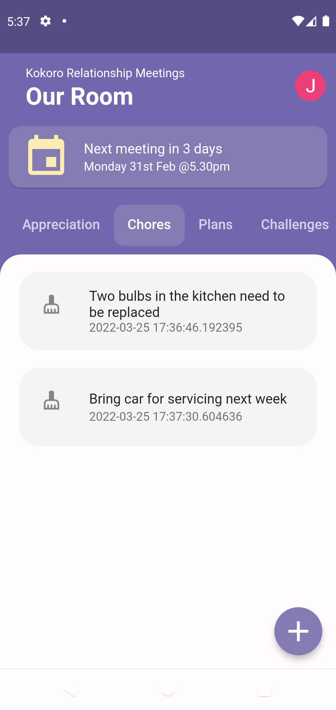

# Kokoro Relationship Meetings

## About Kokoro

This is work-in-progress relationship-meeting app.
- Save notes about your relationship
- Notes are separated into 'Appreciation', 'Chores', 'Plans', and 'Challenges'
- Schedule and have relationship meetings where you through your notes
- Look through your relationship meeting history - a diary of your relationship

** It's like a sprint retrospective for your relationship! **

## Architecture
The app is built using Flutter with a Firebase backend

## Screenshots

<table><tr><td>
    
</td></tr></table>

<table><tr><td>
    
</td></tr></table>

<table><tr><td>
    
</td></tr></table>

